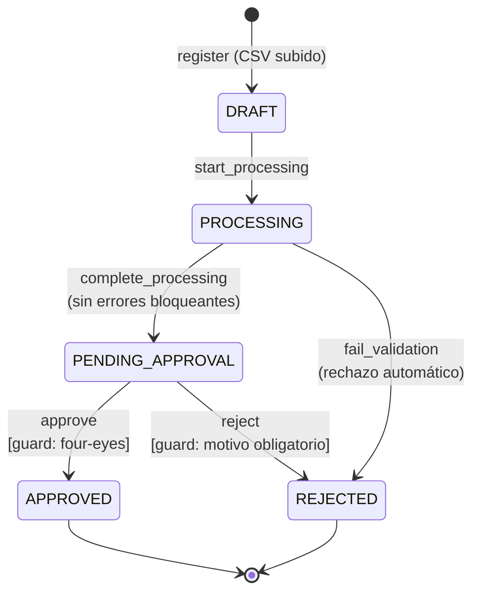
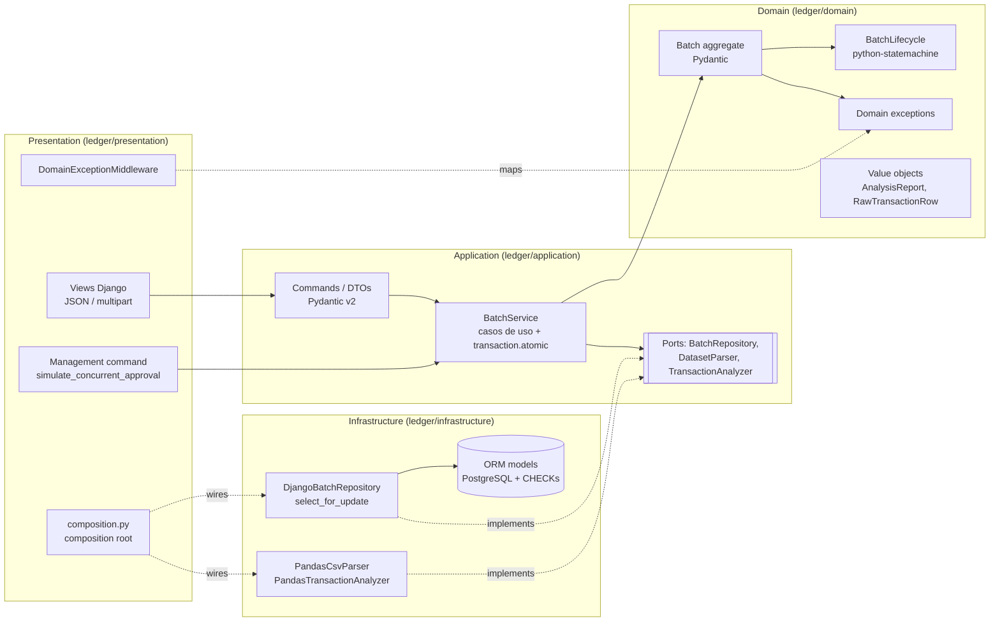
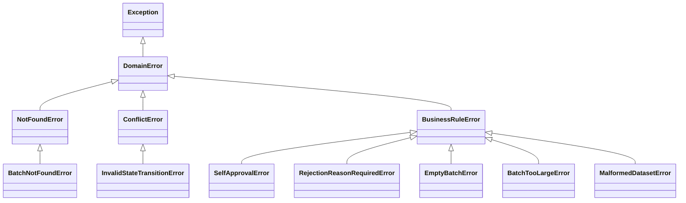

# LedgerSystem: procesamiento y aprobación de lotes de transacciones financieras

[](https://github.com/yoelayan/LedgerSystem/actions/workflows/ci.yml)


[](https://codespaces.new/yoelayan/LedgerSystem?quickstart=1)

Proyecto de referencia que muestra cómo construir un servicio financiero **correcto bajo concurrencia**, con **DDD pragmático**, **errores explícitos** y **fail-fast**, usando Django como API REST, Pydantic v2, pandas y python-statemachine.

Un usuario sube un CSV de transacciones desde la **web** (o la API). Un pequeño **modelo de vectores entrenado localmente** identifica qué columna es cada campo, aunque se llamen distinto ("Importe", "Nº de cuenta", "Fecha valor"…). El sistema lo analiza con pandas (importes, duplicados, divisas, fechas y anomalías estadísticas) y lo lleva por un ciclo de vida controlado por una máquina de estados hasta que un **segundo** usuario lo aprueba o lo rechaza.

Sobre los movimientos aprobados, el módulo de **analítica** muestra tendencias de ingresos y egresos, una línea de tiempo, alertas de posibles patrones de blanqueo y la **conciliación con el libro contable del ERP**.

---

## Índice

- [Casos de uso](#casos-de-uso)

1. [Dominio y ciclo de vida](#1-dominio-y-ciclo-de-vida)
2. [Arquitectura](#2-arquitectura)
3. [Diseño de excepciones](#3-diseño-de-excepciones)
4. [Concurrencia y consistencia](#4-concurrencia-y-consistencia)
5. [Análisis de datos con pandas](#5-análisis-de-datos-con-pandas)
   - [Identificación de columnas](#identificación-de-columnas-modelo-de-vectores)
   - [Formatos locales de importes y fechas](#formatos-locales-de-importes-y-fechas)
   - [Ingresos y egresos](#ingresos-y-egresos)
6. [Analítica](#6-analítica)
7. [Ejecución con Docker](#7-ejecución-con-docker)
   - [Frontend web](#frontend-web)
8. [API](#8-api)
9. [Tests y CI](#9-tests-y-ci)
10. [Decisiones y trade-offs](#10-decisiones-y-trade-offs)

---

## Casos de uso

LedgerSystem es la **puerta de control entre "alguien preparó un lote de movimientos" y "ese lote se ejecuta"**. Revisa el archivo automáticamente, deja la decisión a una segunda persona y guarda quién decidió qué. No ejecuta pagos ni se conecta a bancos: valida y aprueba lo que otro sistema ejecutará.

Leyenda: ✅ funciona hoy · 🔧 encaja con el diseño, pero necesita una ampliación (se indica cuál).

### Validación y control de lotes

| # | Caso de uso | Estado | Qué lo hace posible |
|---|---|---|---|
| 1 | **Verificación automática de integridad antes de enviar un lote a otro sistema financiero** (banco, ERP, pasarela de pagos) | ✅ validación · 🔧 integración | Cada lote pasa por las mismas reglas: importes, divisas, fechas, campos vacíos, IDs duplicados y atípicos. La API REST permite que otro sistema envíe lotes y consulte el resultado. **Para integrarlo en producción faltan** autenticación en la API y un aviso (webhook) cuando un lote se aprueba. |
| 2 | **Revisión de remesas de pagos a proveedores** con el principio de los cuatro ojos | ✅ | Quien sube no aprueba: lo exige el dominio y también la base de datos (`CHECK`). Rechazar exige motivo. |
| 3 | **Revisión de nóminas** antes de mandarlas al banco | ✅ | Detecta cuentas vacías, transacciones duplicadas (misma referencia) e importes fuera de lo normal, como un cero de más. |
| 4 | **Pagos masivos multidivisa** | ✅ | Totales por divisa con `Decimal` (sin errores de redondeo) y lista de divisas admitidas. Los atípicos se calculan por divisa: 3.500.000 COP no es raro, 3.500.000 EUR sí. |
| 5 | **Detección de pagos duplicados** | ✅ | Dentro de un lote, un `external_id` repetido lo bloquea. Entre lotes, la regla *pago repetido* de la analítica avisa cuando el mismo pago (cuenta e importe) aparece en lotes distintos con pocos días de diferencia. |
| 6 | **Detección de errores de tecleo e importes sospechosos** | ✅ | Puntuación z robusta (mediana/MAD) por divisa: un importe desproporcionado se marca como aviso para el aprobador, sin bloquear. |
| 7 | **Revisión de devoluciones o reembolsos masivos** (e-commerce, seguros) | ✅ | Mismo flujo que un pago: el lote se valida y lo aprueba alguien distinto de quien lo preparó. |

### Volumen y datos heterogéneos

| # | Caso de uso | Estado | Qué lo hace posible |
|---|---|---|---|
| 8 | **Estudio de grandes volúmenes de movimientos** | ✅ | Cada lote (hasta 10.000 filas; 5.000 se analizan en 1–2 s) se valida al subirlo. Los movimientos válidos pasan a una tabla consultable, sobre la que la [analítica](#6-analítica) calcula tendencias por día, semana o mes, compara periodos y muestra las cuentas con más movimiento. Para más de 10.000 filas por lote, el análisis debería pasar a una tarea asíncrona (Celery/RQ). |
| 9 | **Unificar exportaciones de distintos bancos o ERPs** | ✅ | Cada exportación trae sus propias cabeceras, separadores y formatos (`Importe`/`Amount`, `;`/`,`, `1.250,50`/`1,250.50`, `DD/MM/AAAA`). El modelo de columnas y la normalización los llevan a un formato común, y se ve qué se interpretó. |
| 10 | **Validación de datos en una migración entre sistemas** | ✅ | Antes de cargar movimientos de un sistema antiguo en uno nuevo: el lote se rechaza con **todos** los errores listados, no solo el primero, para corregirlos de una vez. |
| 11 | **Pre-validación de archivos que suben clientes** (fintech, pasarela de pagos masivos) | ✅ validación · 🔧 multi-cliente | El cliente recibe al momento los errores de cada fila (en el informe del lote, también por la API en JSON) en lugar de un rechazo del banco días después. Para varios clientes faltan autenticación y separación de datos por cliente. |

### Control interno, auditoría y reportes

| # | Caso de uso | Estado | Qué lo hace posible |
|---|---|---|---|
| 12 | **Segregación de funciones para control interno** (p. ej. controles tipo SOX) | ✅ | La regla de que quien prepara no aprueba no depende de la interfaz: la aplica el dominio y la repite la base de datos. |
| 13 | **Trazabilidad para auditoría** | ✅ por lote · 🔧 bitácora completa | Cada lote guarda quién lo subió, quién decidió, cuándo y el motivo del rechazo, cómo se interpretaron las columnas y los valores originales antes de normalizarlos. Una bitácora de *todos* los eventos (quién vio o procesó qué) sería una tabla de eventos adicional. |
| 14 | **Varios aprobadores trabajando a la vez** (equipos de tesorería) | ✅ | Si dos personas aprueban o rechazan el mismo lote simultáneamente, solo una gana y la otra recibe un aviso claro (bloqueo `SELECT ... FOR UPDATE`, probado con tests de concurrencia). |
| 15 | **Informes** | ✅ · 🔧 PDF | Cada lote tiene su **informe de validación**. La analítica exporta a **CSV** (compatible con Excel): totales por periodo y divisa, línea de tiempo, alertas y el informe de conciliación. Todo está también en JSON por la API. No hay exportación a PDF. |
| 16 | **Conciliación contable con el ERP** | ✅ | Se sube la exportación del mayor de bancos y se cruza con lo aprobado: conciliados, discrepancias, aprobados sin contabilizar y contabilizados sin lote. |
| 17 | **Detección de patrones de blanqueo (AML)** | ✅ indicios · 🔧 sistema de riesgo completo | Seis reglas explicables (fraccionamiento, cuenta de paso, importes redondos, velocidad, picos, pagos repetidos) con umbrales ajustables. Son indicios para revisión humana, no un sistema de cumplimiento: no hay listas de sanciones, perfiles de cliente ni reporte a la autoridad. |

### Aprendizaje

| # | Caso de uso | Estado | Qué lo hace posible |
|---|---|---|---|
| 18 | **Proyecto de referencia para equipos de desarrollo** | ✅ | Muestra con código y tests cómo se resuelven problemas reales: DDD con capas verificadas por tests, máquina de estados, errores con código estable, concurrencia con bloqueo pesimista y análisis de datos sin `float` para el dinero. |

### Lo que el sistema **no** hace (y no debería prometerse)

- **Ejecutar pagos** o conectarse a bancos: aprueba lotes que otro sistema ejecutará.
- **Conciliación con el extracto bancario**: concilia con el libro contable del ERP, no con el extracto del banco.
- **Cumplimiento AML completo**: las alertas son indicios para revisar. No hay listas de sanciones, conocimiento del cliente ni reporte a la autoridad.
- **Contabilidad**: no genera asientos ni lleva saldos (el "flujo acumulado" de la línea de tiempo no es un saldo bancario).

---

## 1. Dominio y ciclo de vida



Reglas de negocio:

| Regla | Dónde se aplica | Error |
|---|---|---|
| Un lote debe tener entre 1 y 10.000 filas | `Batch.register` / parser | `EmptyBatchError`, `BatchTooLargeError` |
| Solo se permiten las transiciones del diagrama | `BatchLifecycle` (python-statemachine) | `InvalidStateTransitionError` |
| **Four-eyes**: quien sube el lote no puede aprobarlo | validator `guard_four_eyes` + `CHECK` en BD | `SelfApprovalError` |
| Rechazar exige un motivo no vacío | validator `guard_reason_given` | `RejectionReasonRequiredError` |
| Errores de datos bloqueantes → rechazo automático | `Batch.record_analysis` | (transición a `REJECTED`, no es excepción) |

Los *guards* se implementan como **validators** de python-statemachine. La librería primero comprueba que la transición exista desde el estado actual y solo después ejecuta el validator; si este lanza una excepción, la transición se aborta **sin tocar el estado**. Por eso aprobar un lote ya aprobado devuelve un conflicto de estado (409) y no un error de four-eyes, aunque lo intente el propio autor.

## 2. Arquitectura



```
ledger/
├── domain/                 # Python puro + Pydantic. Sin Django ni pandas.
│   ├── entities.py         # Aggregate root Batch
│   ├── state_machine.py    # BatchLifecycle (python-statemachine) + guards
│   ├── value_objects.py    # BatchStatus, AnalysisReport, Transaction, políticas
│   ├── exceptions.py       # Jerarquía de errores de dominio
│   └── analytics/          # Motores puros: trends, timeline, aml, reconciliation
├── application/
│   ├── services.py         # BatchService: casos de uso, transacciones, locking
│   ├── analytics.py        # AnalyticsService: resumen, línea de tiempo, AML, conciliación
│   ├── dtos.py             # Commands de entrada y DTOs de salida (Pydantic)
│   └── ports.py            # Protocols que la infraestructura implementa
├── infrastructure/         # App Django (label "ledger")
│   ├── models.py           # ORM solo para persistencia + CHECK constraints
│   ├── repositories.py     # DjangoBatchRepository + proyección a la tabla de transacciones
│   ├── read_models.py      # Consultas de analítica sobre las transacciones
│   ├── migrations/
│   └── analysis/           # Parser CSV, identificación de columnas y analizador pandas
│       ├── column_mapping.py        # Modelo TF-IDF + perfilado de valores
│       ├── column_vocabulary.json   # Datos de entrenamiento: nombres conocidos por campo
│       ├── directions.py            # Ingreso/egreso: columna de tipo o signo declarado
│       └── ledger_parser.py         # Lector del libro contable del ERP
└── presentation/
    ├── composition.py      # Composition root (único sitio que conoce adaptadores)
    ├── api/                # Views, URLs, middleware de errores, problem+json
    ├── web/                # Frontend: lotes, analítica y Chart.js incluido en vendor/
    ├── templates/          # Plantillas Django (HTML + CSS en línea, sin build)
    └── management/commands/  # simulate_concurrent_approval, create_demo_users, load_demo_analytics
```

La dirección de las dependencias es siempre hacia dentro y **se verifica con tests** (`tests/architecture/test_layers.py`, que analiza los imports con `ast`). Si alguien importa Django o pandas desde el dominio, CI falla.

## 3. Diseño de excepciones



**Principios:**

1. **Una excepción por regla violada.** Cada una lleva un `code` estable y legible por máquina (`SELF_APPROVAL_FORBIDDEN`) y un `context` estructurado (`batch_id`, `actor`...). El cliente puede reaccionar sin tener que analizar el texto del mensaje.
2. **El dominio no sabe de HTTP.** Cada error concreto hereda de exactamente **una categoría** y el middleware mapea categorías, no clases concretas:

   | Categoría | HTTP |
   |---|---|
   | `NotFoundError` | 404 |
   | `ConflictError` | 409 |
   | `BusinessRuleError` | 400 |
   | `RequestValidationError` (capa de presentación) | 400 |

   Un error nuevo hereda su código HTTP sin tocar el middleware. Un test comprueba que todo error concreto pertenece a una sola categoría y tiene un `code` único.
3. **Fail-fast: el middleware solo traduce lo que conoce.** `process_exception` devuelve `None` para cualquier otra excepción (`RuntimeError`, `OperationalError`, incluso un `DomainError` sin categoría). Django la trata como 500 y registra la traza completa en `django.request`. El `handler500` responde con un `problem+json` genérico que no filtra detalles internos.
4. **No hay `except Exception`.** La regla `BLE` (blind except) de Ruff está activa en todo el proyecto. Los únicos `except` capturan tipos concretos para **traducirlos** (`TransitionNotAllowed` → `InvalidStateTransitionError`, `DoesNotExist` → `BatchNotFoundError`, `ParserError` → `MalformedDatasetError`) y siempre encadenan la causa con `raise ... from exc`.

Las respuestas de error siguen [RFC 9457 (Problem Details)](https://www.rfc-editor.org/rfc/rfc9457):

```json
HTTP/1.1 409 Conflict
Content-Type: application/problem+json

{
  "type": "about:blank",
  "title": "Conflict",
  "status": 409,
  "code": "INVALID_STATE_TRANSITION",
  "detail": "Cannot 'approve' batch 3f0c... while it is APPROVED.",
  "context": {"batch_id": "3f0c...", "current_status": "APPROVED", "event": "approve"}
}
```

## 4. Concurrencia y consistencia

**Problema:** dos aprobadores pulsan "aprobar" a la vez. Sin control, ambos leen `PENDING_APPROVAL`, ambos pasan la validación en memoria y ambos escriben. El resultado es un *lost update*: la segunda escritura pisa a la primera y las dos peticiones responden 200.

**Solución:** cada cambio de estado sigue el mismo patrón en `BatchService`:

```python
with transaction.atomic():
    batch = repository.get_for_update(batch_id)  # SELECT ... FOR UPDATE
    batch.approve(approver=..., now=...)  # reglas + máquina de estados
    repository.save(batch)
```

```mermaid
sequenceDiagram
    autonumber
    participant Bob
    participant Carol
    participant PG as PostgreSQL
    Bob->>PG: BEGIN; SELECT ... FOR UPDATE (PENDING_APPROVAL)
    Carol->>PG: BEGIN; SELECT ... FOR UPDATE
    Note over Carol,PG: bloqueada esperando el lock de la fila
    Bob->>PG: UPDATE status = APPROVED; COMMIT
    PG-->>Carol: fila liberada: lee APPROVED (ya confirmado)
    Carol->>Carol: InvalidStateTransitionError
    Carol->>PG: ROLLBACK → HTTP 409
```

Detalles:

- **Bloqueo pesimista** en lugar de optimista: aprobar es poco frecuente y de mucho valor. Es preferible serializar y dar al perdedor un 409 claro a gestionar reintentos por conflicto de versión.
- **La transacción la abre el caso de uso**, no la petición (`ATOMIC_REQUESTS = False`). El límite de consistencia es explícito y visible en el código.
- **Sin locks durante trabajo pesado:** `process_batch` tiene tres fases. (1) Reclamar el lote (`DRAFT → PROCESSING`) bajo lock y hacer commit. (2) Ejecutar el análisis pandas **sin** transacción ni locks. (3) Registrar el resultado bajo lock. Un segundo "process" concurrente recibe 409 en la fase 1 en lugar de analizar dos veces los mismos datos.
- **`get_for_update` fuera de una transacción falla:** Django lanza `TransactionManagementError` y hay un test que lo comprueba.
- **Defensa en profundidad:** constraints `CHECK` en PostgreSQL (estado válido, aprobado ⇒ tiene aprobador, aprobador ≠ autor).

**Cómo se demuestra** (`tests/integration/test_concurrency.py`, contra PostgreSQL real, con `transaction=True` e hilos que usan conexiones separadas):

| Test | Qué prueba |
|---|---|
| `test_two_simultaneous_approvals_only_one_wins` | Dos hilos sincronizados con una `Barrier`: exactamente uno aprueba y el otro recibe `InvalidStateTransitionError`. |
| `test_second_approver_blocks_on_the_row_lock_until_the_first_commits` | **Determinista:** el primer aprobador retiene el lock; se verifica que el segundo sigue **bloqueado** y que, tras el commit, recibe el conflicto. |
| `test_without_the_lock_a_lost_update_happens` | **Contraejemplo:** con un repositorio sin `FOR UPDATE`, ambas aprobaciones "tienen éxito" y una se pierde. Documenta el bug que el lock evita. |
| `test_locking_read_outside_a_transaction_fails_loudly` | `select_for_update()` fuera de `atomic()` lanza una excepción. |

También puedes verlo en vivo:

```bash
docker compose exec web python manage.py simulate_concurrent_approval
```

## 5. Análisis de datos con pandas

`PandasCsvParser` rechaza solo problemas **estructurales**: el archivo no es UTF-8, no es un CSV válido, no se pueden identificar las columnas, está vacío o es demasiado grande. Detecta el separador (`,` `;` tabulador `|`) y acepta el BOM que añade Excel. Los valores que no se pueden interpretar se guardan tal cual, para que el análisis pueda **informar de todos los errores** y no solo del primero.

`PandasTransactionAnalyzer` aplica reglas vectorizadas:

| Código | Severidad | Regla |
|---|---|---|
| `MISSING_VALUE` | ERROR | Columna obligatoria vacía |
| `INVALID_AMOUNT` | ERROR | No es un decimal finito (`12,50`, `abc`, `NaN`, `Infinity`) |
| `NON_POSITIVE_AMOUNT` | ERROR | Importe ≤ 0 |
| `EXCESSIVE_PRECISION` | ERROR | Más de 2 decimales |
| `UNSUPPORTED_CURRENCY` | ERROR | Divisa fuera de USD, EUR, GBP, MXN, COP |
| `INVALID_VALUE_DATE` | ERROR | Fecha que no cumple `YYYY-MM-DD` |
| `DUPLICATE_EXTERNAL_ID` | ERROR | `external_id` repetido (se marcan todas las repeticiones salvo la primera) |
| `AMOUNT_OUTLIER` | WARNING | *Modified z-score* > 3.5 por divisa (n ≥ 5) |

- Los **ERROR** rechazan el lote automáticamente (`PROCESSING → REJECTED`, `decided_by = "system"`).
- Los **WARNING** no bloquean: el aprobador los ve en el informe antes de decidir.
- Las anomalías se detectan con la **puntuación z robusta** (mediana/MAD, Iglewicz & Hoaglin). Con la z clásica, un único importe enorme infla la desviación típica y queda enmascarado. Solo se calcula sobre filas válidas y por divisa.
- **El dinero se suma con `Decimal`**, nunca con `float`. Los floats se usan únicamente para la estadística.

### Identificación de columnas (modelo de vectores)

Los archivos reales casi nunca traen nuestras cabeceras. `VectorColumnMapper` (`ledger/infrastructure/analysis/column_mapping.py`) decide qué columna alimenta cada campo **sin servicios externos ni coste por uso**. Combina dos señales:

1. **Nombre de la cabecera: un modelo entrenado.** `HeaderClassifier` se entrena al arrancar con [`column_vocabulary.json`](ledger/infrastructure/analysis/column_vocabulary.json), una lista de nombres posibles por campo en español e inglés. Convierte cada cabecera en un vector TF-IDF de n-gramas de caracteres (scikit-learn) y busca la cabecera conocida más cercana por similitud coseno. Los n-gramas le permiten reconocer variantes que nunca vio: `Importe neto (EUR)`, `Fcha valor`, `Divsa`. Antes se normaliza: Unidecode quita los acentos y se ignoran mayúsculas y puntuación.
2. **Valores: perfilado de contenido.** Mira una muestra de los valores: códigos ISO 4217 (pycountry) → divisa, IBAN válidos (schwifty) → cuenta, fechas interpretables (python-dateutil) → fecha valor, decimales → importe, códigos únicos → ID. Así, incluso `col1…col5` se asignan bien.

| Cómo se identificó | Confianza | Ejemplo |
|---|---|---|
| `EXACT` | 100 % | `amount` |
| `VOCABULARY` (está en la lista) | 95–100 % | `Moneda`, `Nº de cuenta` |
| `SIMILARITY` (se parece a uno de la lista) | 0,9 × similitud | `Importe neto (EUR)`, `Fcha valor` |
| `CONTENT` (solo por los valores) | ≤ 70 % | `col3` con `1250.50`, `980.00`… |

Las columnas se asignan de mayor a menor puntuación; cada columna alimenta un solo campo. Una columna sin nada reconocible (`Descripcion`) se ignora en vez de forzarla. Si falta algún campo, el lote no se registra y el error dice qué columnas se encontraron.

El resultado se **guarda con el lote y se muestra al aprobador**: qué columna se usó, cómo se identificó y con qué confianza. En un sistema que mueve dinero, una suposición automática tiene que ser visible.

**Para enseñarle una cabecera nueva**, añádela a `column_vocabulary.json`; no hace falta tocar código. Del vocabulario se excluyeron a propósito términos como `saldo`, `debe`/`haber` o `precio`: se parecen a un importe, pero no son el importe de la transacción.

### Formatos locales de importes y fechas

Una vez identificadas las columnas, `value_normalization.py` reescribe importes y fechas al formato que espera el análisis (`1250.50`, `2026-09-01`):

| En el archivo | Queda como |
|---|---|
| `1.250,50` · `1 250,50` · `€ 1.250,50` · `1.250,50 EUR` | `1250.50` |
| `1,250.50` · `12'345.60` · `USD 1,250.50` | `1250.50` / `12345.60` |
| `(12,00)` (negativo contable) | `-12.00` (y el análisis lo marca como no positivo) |
| `01/09/2026` · `1.9.2026` · `2026/09/01` · `2026-09-01 00:00:00` | `2026-09-01` |

**El formato se decide por columna, no valor a valor.** `1.250` significa 1250 en una columna que también tiene `980,50`, y 1.25 en una que tiene `980.50`. Decidirlo valor a valor dejaría que un mismo archivo mezcle las dos lecturas.

Cuando la columna no permite decidir, se aplica una política deliberadamente distinta para importes y para fechas:

- **Importes: no se adivina.** Si todos los importes son del tipo `1,250` (¿mil doscientos cincuenta o uno con veinticinco?) o la columna mezcla ambos formatos, los valores se dejan tal cual y el análisis los marca como error. Leer un importe mil veces mayor no es un riesgo aceptable.
- **Fechas: se asume día/mes y se avisa.** Si todas las fechas encajan en ambos órdenes (`03/04/2026`), se usa día/mes, la convención de Europa y Latinoamérica, y el detalle del lote muestra "Ambiguo: se asumió día/mes". Una fecha que no encaja en el formato mayoritario de su columna se deja tal cual y el análisis la marca.

Nada se pierde: cada fila guarda en `original_values` lo que decía el archivo en los campos convertidos, y el aprobador ve ambos valores. El formato detectado se guarda en el mapeo de columnas (`value_format`, `format_ambiguous`). Años de dos dígitos (`01/09/26`) no se interpretan: su siglo es otra suposición.

### Ingresos y egresos

Cada movimiento es un **ingreso** o un **egreso** desde el punto de vista de la organización. El sentido solo sale de algo explícito:

1. **Una columna de tipo**, reconocida por el mismo modelo de cabeceras (`Tipo`, `Tipo de movimiento`, `Naturaleza`, `D/C`…). Sus valores se leen como en un extracto: `Egreso`, `Salida`, `Cargo`, `Débito`, `D`, `Pago` → egreso; `Ingreso`, `Entrada`, `Abono`, `Crédito`, `C`, `Cobro` → ingreso. Un valor que no se entiende bloquea la fila (`INVALID_DIRECTION`).
2. **Importes con signo**, si quien sube el archivo lo declara (casilla al subir, o `signed_amounts=true` en la API): negativo = egreso.
3. **Ninguno de los dos**: el lote es de pagos y todo es egreso, como hasta ahora.

**El signo nunca decide por sí solo.** En un lote de pagos, un `-40.00` es mucho más probablemente un error que un cobro. Convertirlo en ingreso escondería el error, así que sin declaración sigue siendo negativo y el análisis lo rechaza. Si la columna de tipo dice egreso y el importe es negativo, el signo concuerda y se quita. Si dice ingreso, es una contradicción y se rechaza.

El análisis separa los totales en ingresos y egresos por divisa, y calcula los atípicos por divisa **y** sentido: un cobro grande no es un atípico de los pagos.

## 6. Analítica

Menú **Analítica** en la web y `/api/v1/analytics/` en la API. Trabaja sobre una **tabla de transacciones** (`ledger_transaction`): cada movimiento válido de un lote se guarda ahí al analizarlo, en la misma transacción que el lote. Una migración rellenó el histórico. Por defecto solo cuentan los lotes **aprobados**; un filtro permite incluir los pendientes. Todos los filtros (fechas, divisa, cuenta) son comunes a las cuatro pantallas, y cada una se descarga en CSV.

Los cálculos son **Python puro en el dominio** (`ledger/domain/analytics/`), con `Decimal` para el dinero y 100 % de cobertura de tests. Las divisas nunca se mezclan ni se convierten: cada una tiene sus totales y su gráfico.

| Pantalla | Qué muestra |
|---|---|
| **Resumen y tendencias** | Ingresos, egresos, neto y nº de movimientos por divisa. Gráfico por día, semana o mes (los periodos vacíos cuentan como cero). Variación del último periodo frente al anterior y a la media de los tres previos. Las 10 cuentas con más movimiento. |
| **Línea de tiempo** | Flujo neto acumulado día a día (por fecha valor) y una cronología que junta los movimientos de cada día con quién subió, aprobó o rechazó cada lote. Filtrando por cuenta, es la historia de esa cuenta. |
| **Patrones de blanqueo** | Alertas de seis reglas explicables, ordenadas por severidad, con los movimientos implicados y una frase que dice por qué saltaron. |
| **Conciliación con el ERP** | Cruce de lo aprobado con el libro contable del ERP (ver abajo). |

### Patrones de blanqueo (AML)

Reglas por cuenta y divisa, con umbrales ajustables en `AmlPolicy` (`ledger/domain/analytics/aml.py`). El umbral de declaración por defecto equivale a unos 10.000 USD (10.000 EUR, 180.000 MXN, 40.000.000 COP…):

| Regla | Salta cuando… | Severidad |
|---|---|---|
| Fraccionamiento (*pitufeo*) | ≥ 3 importes entre el 80 % y el 100 % del umbral en 7 días | Alta si juntos superan el umbral |
| Cuenta de paso | Entra ≥ 50 % del umbral y sale ≥ 90 % de eso en 3 días | Alta |
| Pico de actividad | El volumen de un mes supera 5 veces la mediana de los meses anteriores (≥ 3 meses de historia) | Media |
| Muchos movimientos en un día | Más de 10 movimientos de la cuenta en un día | Media |
| Pago repetido entre lotes | El mismo egreso (cuenta e importe) en lotes distintos con ≤ 7 días de diferencia | Media |
| Importes redondos | ≥ 60 % de los movimientos (mínimo 3) son múltiplos exactos de umbral/10 | Baja |

**Son indicios, no conclusiones.** Cualquier negocio legítimo puede activar una regla; la decisión de investigar o reportar es siempre de una persona. Se eligieron reglas en vez de un modelo opaco precisamente para que cada alerta se pueda explicar y discutir.

### Conciliación con el libro contable del ERP

Se sube la exportación del **mayor de la cuenta de bancos** (p. ej. la 572 del PGC) y se cruza con los movimientos aprobados de las mismas fechas (± la tolerancia) y divisas:

1. **Por referencia**: el documento o referencia del apunte coincide con el `external_id`. Si coincide pero difieren el importe, la divisa, el sentido o la fecha (más allá de la tolerancia), es una **discrepancia**: no se empareja en silencio.
2. **Por importe y fecha**: los apuntes sin referencia útil se emparejan con un movimiento del mismo importe, divisa y sentido dentro de la tolerancia (gana la fecha más cercana).

Cada movimiento se usa una sola vez. El resultado tiene cuatro listas: **conciliados**, **discrepancias**, **aprobados sin contabilizar** y **contabilizados sin lote**. A esas se suman las líneas del archivo que no se pudieron leer, cada una con su motivo, sin que eso detenga el resto. Un movimiento de justo antes del periodo del archivo puede conciliarse gracias a la tolerancia, pero si no concilia no se reporta como pendiente: pertenece al mayor del periodo anterior.

El archivo se lee con el mismo modelo de columnas y la misma normalización de formatos que los lotes. Admite:

- columnas **Debe/Haber**;
- un importe más una columna **D/H** (o Debe/Haber, Cargo/Abono);
- un **importe con signo** (positivo = Debe).

En la cuenta de bancos, **Debe = entra dinero** y **Haber = sale**. Si se exporta la cuenta de proveedores o clientes, se marca *Invertir Debe/Haber*. Con un único importe sin signo ni columna de tipo, el sistema se niega a adivinar y pide el dato que falta. Sin columna de divisa, se usa la elegida al subir.

### Datos de demo

`samples/analitica/` trae seis lotes mensuales (abril–septiembre 2026, ~1.600 movimientos, en EUR y USD) y el mayor de bancos de septiembre. Tienen **plantado un caso de cada patrón** de blanqueo y, en el mayor, diferencias conocidas: un importe distinto, dos pagos sin contabilizar, una comisión y una transferencia sin lote, apuntes sin referencia y una línea ilegible. Para cargarlos (los sube `alice` y los aprueba `bob`, con fechas de cada mes):

```bash
docker compose exec web python manage.py load_demo_analytics
```

Luego sube `samples/analitica/erp_mayor_bancos_2026_09.csv` en *Analítica → Conciliación con el ERP*. Los regenera `scripts/generate_demo_analytics.py`, con semilla fija. En Codespaces la demo se carga sola al arrancar.

## 7. Ejecución con Docker

Requisitos: Docker con Compose v2.

```bash
docker compose up --build
```

Esto levanta PostgreSQL 16 y la aplicación (gunicorn) en `http://localhost:8000`. Aplica las migraciones, crea los usuarios de demo y espera a que la BD esté sana. Para cambiar la configuración copia `.env.example` a `.env`.

Prueba rápida (requiere `curl` y `jq`; en Windows funciona desde Git Bash):

```bash
bash scripts/smoke_test.sh
```

### Frontend web

Abre `http://localhost:8000` y entra con uno de los usuarios de demo: `alice`, `bob` o `carol`, con contraseña `demo1234` (configurable con `DEMO_USERS_PASSWORD`; en `DJANGO_ENV=production` no se crean).

- **Lotes**: listado con filtro por estado.
- **Subir CSV**: sube el archivo y lo analiza al momento. Prueba con `samples/banco_es.csv`, que usa `;`, cabeceras en español, importes `1.250,00` y fechas `01/09/2026`.
  Para probar con volumen:
  - `samples/lote_5000.csv`: 5000 transacciones limpias en EUR, USD, MXN y COP. Llega a *pendiente de aprobación* con unos pocos importes atípicos como aviso.
  - `samples/lote_5000_con_errores.csv`: el mismo lote con 25 filas problemáticas (importe, divisa, fecha, cuenta vacía y referencia duplicada). Se rechaza automáticamente con todos los problemas listados.
  - Los genera `scripts/generate_sample_batch.py`, con semilla fija; admite `--rows`, `--errors` y `--outliers`.
- **Detalle**: resumen y totales por divisa, las **columnas identificadas** con su confianza y el formato convertido, los problemas encontrados y las transacciones (filas con error o aviso resaltadas; bajo cada importe o fecha convertido, el valor original).
- **Aprobar / Rechazar**: el actor es siempre el usuario con sesión iniciada. Quien sube un lote no puede aprobarlo (el botón aparece desactivado y el dominio lo rechaza igualmente). Rechazar exige motivo.

Son plantillas Django renderizadas en el servidor, con CSS en línea: no hay paso de build ni dependencias de frontend. Usan los mismos casos de uso que la API.

### Probarlo en GitHub Codespaces (sin instalar nada)

El repo incluye un `.devcontainer/`, así que puedes tener un entorno funcionando directamente en GitHub:

1. Pulsa el botón **Open in GitHub Codespaces** de arriba (o *Code → Codespaces → Create codespace*).
2. Al arrancar, el codespace ejecuta `docker compose up` solo: PostgreSQL + la aplicación ya migrada en el puerto `8000`. La primera vez tarda unos minutos porque construye las imágenes.
3. Se abre el navegador con la web (si no, pestaña **Ports** → puerto 8000). Entra con `alice` / `demo1234`, sube `samples/banco_es.csv` y apruébalo después como `bob`. La [demo de analítica](#datos-de-demo) ya está cargada: mira el menú **Analítica**.
4. La API está en la misma URL, bajo `/api/v1/`. Para llamarla desde fuera del navegador (Postman, curl en tu máquina), cambia la visibilidad del puerto a *Public*.
5. Desde la terminal del codespace puedes lanzar todo tal cual:

```bash
bash scripts/smoke_test.sh
docker compose exec web python manage.py simulate_concurrent_approval
docker compose --profile test run --rm tests
```

## 8. API

Base: `/api/v1`. La API no incluye autenticación (fuera del alcance de la demo): el actor se envía explícitamente en el payload. El login protege el frontend web. Proteger también la API, con tokens o sesión, es un cambio pendiente si esto se expone.

| Método | Ruta | Cuerpo | Respuesta |
|---|---|---|---|
| `GET` | `/health/` | | `200 {"status": "ok"}` (comprueba la BD) |
| `POST` | `/batches/` | multipart: `reference`, `submitted_by`, `file` (CSV) | `201` lote en `DRAFT` |
| `GET` | `/batches/` | | `200 {"items": [...]}` |
| `GET` | `/batches/{id}/` | | `200` / `404` |
| `POST` | `/batches/{id}/process/` | | `200` `PENDING_APPROVAL` o `REJECTED` / `409` |
| `POST` | `/batches/{id}/approve/` | `{"approver": "bob"}` | `200` / `400` / `409` |
| `POST` | `/batches/{id}/reject/` | `{"reviewer": "bob", "reason": "..."}` | `200` / `400` / `409` |
| `GET` | `/analytics/overview/` | query: `date_from`, `date_to`, `currency`, `account`, `include_pending`, `granularity` (`DAY`/`WEEK`/`MONTH`) | `200` totales, serie, tendencias, cuentas / `400` |
| `GET` | `/analytics/timeline/` | mismos filtros | `200` días con flujo acumulado + cronología |
| `GET` | `/analytics/aml/` | mismos filtros | `200` alertas con movimientos y umbrales |
| `POST` | `/analytics/reconciliation/` | multipart: `file` (mayor del ERP), `default_currency`, `invert_debit_credit`, `date_tolerance_days` | `200` conciliados, discrepancias y pendientes de cada lado / `400` |

`POST /batches/` acepta además `signed_amounts=true` (ver [Ingresos y egresos](#ingresos-y-egresos)).

Formato del CSV (ver `samples/`). Las cabeceras pueden llamarse distinto: ver [Identificación de columnas](#identificación-de-columnas-modelo-de-vectores). La respuesta incluye `column_mapping` con la columna elegida para cada campo.

```csv
external_id,account,amount,currency,value_date
TX-1001,US33-0001,1250.00,USD,2026-09-01
```

Ejemplo:

```bash
curl -F reference=sept -F submitted_by=alice -F file=@samples/clean_batch.csv http://localhost:8000/api/v1/batches/
```

```bash
curl -X POST http://localhost:8000/api/v1/batches/<id>/process/
```

```bash
curl -H "Content-Type: application/json" -d '{"approver":"bob"}' http://localhost:8000/api/v1/batches/<id>/approve/
```

## 9. Tests y CI

```
tests/
├── unit/domain/          # máquina de estados, guards, excepciones y motores de analítica
├── unit/application/     # AnalyticsService con dobles en memoria
├── unit/infrastructure/  # parser CSV, columnas, formatos, ingreso/egreso, mayor del ERP (sin BD)
├── unit/test_middleware.py
├── integration/          # casos de uso, repositorio, constraints, API, web, analítica y concurrencia (PostgreSQL)
└── architecture/         # reglas de dependencias entre capas
```

Ejecutar la suite dentro de Docker (no necesitas Python en local):

```bash
docker compose --profile test run --rm tests
```

O en local, con un PostgreSQL accesible:

```bash
pip install -r requirements-dev.txt
```

```bash
pytest
```

**GitHub Actions** (`.github/workflows/ci.yml`) ejecuta tres jobs en cada push y pull request:

1. **quality**: `ruff check` (incluye `BLE`, que prohíbe `except Exception`), `ruff format` y `mypy --strict` sobre dominio y aplicación.
2. **tests**: PostgreSQL como service container; comprueba que las migraciones están sincronizadas (`makemigrations --check`), ejecuta pytest con cobertura de ramas y **exige 100 % en dominio y aplicación**.
3. **docker**: `docker compose up --wait`, smoke test end-to-end con `curl`, la demo de concurrencia y la suite completa dentro de la imagen de test.

## 10. Decisiones y trade-offs

- **Django sin DRF.** Los DTOs y la validación ya son Pydantic v2. Añadir los serializers de DRF duplicaría los esquemas, así que las vistas se limitan a traducir HTTP ↔ commands/DTOs.
- **La capa de aplicación importa `django.db.transaction` y nada más de Django.** Un puerto Unit-of-Work añadiría indirección sin aportar valor en un servicio con una sola base de datos. La excepción está acotada y verificada por un test de arquitectura.
- **Entidad Pydantic + máquina de estados enlazada al modelo.** `BatchLifecycle` lee y escribe `batch.status` directamente (`state_field="status"`), así que no hay una segunda copia del estado que pueda desincronizarse. La máquina se crea por operación: es barata y no tiene estado propio.
- **Un lote atascado en `PROCESSING` es intencionado.** Si el análisis falla por un error inesperado, la excepción se propaga y el lote queda visible en `PROCESSING`, en vez de revertirse en silencio o rechazarse como si fuera culpa del usuario. En producción este paso sería una tarea asíncrona (Celery/RQ) con reintentos y una alerta por antigüedad en `PROCESSING`.
- **Datos crudos en JSONB + tabla de transacciones para consultar.** Las filas del lote se guardan en JSONB tal como llegaron, salvo importes y fechas en formato local, que se convierten al canónico conservando el valor original en `original_values` (auditoría). Los movimientos válidos se proyectan además en `ledger_transaction`, con tipos reales e índices por fecha, cuenta y divisa, para la analítica. La proyección se escribe una vez, en la misma transacción que el análisis del lote.
- **La analítica calcula en Python, no en SQL.** El modelo de lectura trae los movimientos filtrados y los motores del dominio hacen el resto. Es explicable, portable y 100 % testeable sin base de datos, y con ~10.000 movimientos responde en unos 0,3 s. Con millones de movimientos convendría empujar las agregaciones de tendencias a SQL (`GROUP BY` por periodo) y dejar en Python solo las reglas AML por cuenta.
- **Chart.js incluido en el repositorio** (`ledger/presentation/web/vendor/`, licencia MIT), servido por la app con caché larga, en vez de un CDN: los gráficos funcionan sin internet y tras proxies corporativos. Cada gráfico tiene además su tabla de datos.
