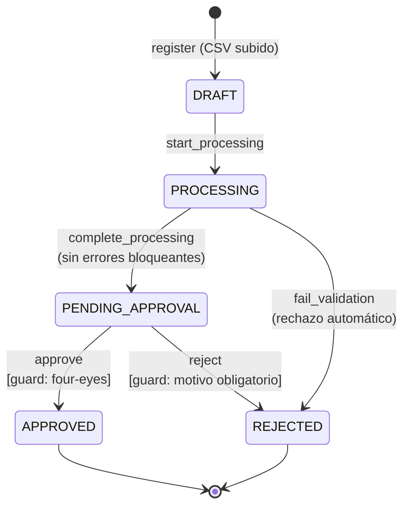
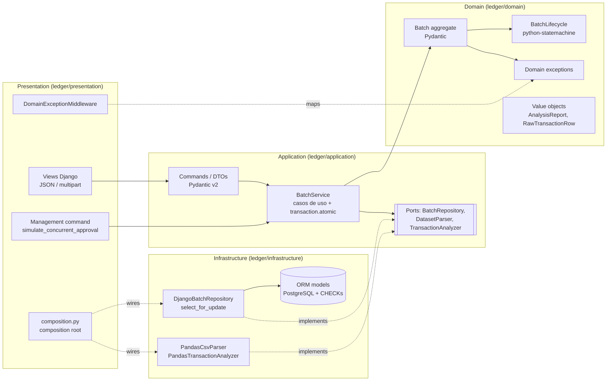

# LedgerSystem: procesamiento y aprobación de lotes de transacciones financieras

[](https://github.com/yoelayan/LedgerSystem/actions/workflows/ci.yml)


Proyecto de referencia que muestra cómo construir un servicio financiero **correcto bajo concurrencia**, con **DDD pragmático**, **errores explícitos** y **fail-fast**, usando Django como API REST, Pydantic v2, pandas y python-statemachine.

Un usuario sube un CSV de transacciones. El sistema lo analiza con pandas (importes, duplicados, divisas, fechas y anomalías estadísticas) y lo lleva por un ciclo de vida controlado por una máquina de estados hasta que un **segundo** usuario lo aprueba o lo rechaza.

---

## Índice

1. [Dominio y ciclo de vida](#1-dominio-y-ciclo-de-vida)
2. [Arquitectura](#2-arquitectura)
3. [Diseño de excepciones](#3-diseño-de-excepciones)
4. [Concurrencia y consistencia](#4-concurrencia-y-consistencia)
5. [Análisis de datos con pandas](#5-análisis-de-datos-con-pandas)
6. [Ejecución con Docker](#6-ejecución-con-docker)
7. [API](#7-api)
8. [Tests y CI](#8-tests-y-ci)
9. [Decisiones y trade-offs](#9-decisiones-y-trade-offs)

---

## 1. Dominio y ciclo de vida



Reglas de negocio:

| Regla | Dónde se aplica | Error |
|---|---|---|
| Un lote debe tener entre 1 y 10.000 filas | `Batch.register` / parser | `EmptyBatchError`, `BatchTooLargeError` |
| Solo se permiten las transiciones del diagrama | `BatchLifecycle` (python-statemachine) | `InvalidStateTransitionError` |
| **Four-eyes**: quien sube el lote no puede aprobarlo | validator `guard_four_eyes` + `CHECK` en BD | `SelfApprovalError` |
| Rechazar exige un motivo no vacío | validator `guard_reason_given` | `RejectionReasonRequiredError` |
| Errores de datos bloqueantes → rechazo automático | `Batch.record_analysis` | (transición a `REJECTED`, no es excepción) |

Los *guards* se implementan como **validators** de python-statemachine. La librería primero comprueba que la transición exista desde el estado actual y solo después ejecuta el validator; si este lanza una excepción, la transición se aborta **sin tocar el estado**. Por eso aprobar un lote ya aprobado devuelve un conflicto de estado (409) y no un error de four-eyes, aunque lo intente el propio autor.

## 2. Arquitectura



```
ledger/
├── domain/                 # Python puro + Pydantic. Sin Django ni pandas.
│   ├── entities.py         # Aggregate root Batch
│   ├── state_machine.py    # BatchLifecycle (python-statemachine) + guards
│   ├── value_objects.py    # BatchStatus, AnalysisReport, políticas (límites, divisas)
│   └── exceptions.py       # Jerarquía de errores de dominio
├── application/
│   ├── services.py         # BatchService: casos de uso, transacciones, locking
│   ├── dtos.py             # Commands de entrada y DTOs de salida (Pydantic)
│   └── ports.py            # Protocols que la infraestructura implementa
├── infrastructure/         # App Django (label "ledger")
│   ├── models.py           # ORM solo para persistencia + CHECK constraints
│   ├── repositories.py     # DjangoBatchRepository + mapeo entidad <-> modelo
│   ├── migrations/
│   └── analysis/           # Adaptadores pandas (parser CSV + analizador)
└── presentation/
    ├── composition.py      # Composition root (único sitio que conoce adaptadores)
    ├── api/                # Views, URLs, middleware de errores, problem+json
    └── management/commands/simulate_concurrent_approval.py
```

La dirección de las dependencias es siempre hacia dentro y **se verifica con tests** (`tests/architecture/test_layers.py`, que analiza los imports con `ast`). Si alguien importa Django o pandas desde el dominio, CI falla.

## 3. Diseño de excepciones


**Principios:**

1. **Una excepción por regla violada.** Cada una lleva un `code` estable y legible por máquina (`SELF_APPROVAL_FORBIDDEN`) y un `context` estructurado (`batch_id`, `actor`...). El cliente puede reaccionar sin tener que analizar el texto del mensaje.
2. **El dominio no sabe de HTTP.** Cada error concreto hereda de exactamente **una categoría** y el middleware mapea categorías, no clases concretas:

   | Categoría | HTTP |
   |---|---|
   | `NotFoundError` | 404 |
   | `ConflictError` | 409 |
   | `BusinessRuleError` | 400 |
   | `RequestValidationError` (capa de presentación) | 400 |

   Un error nuevo hereda su código HTTP sin tocar el middleware. Un test comprueba que todo error concreto pertenece a una sola categoría y tiene un `code` único.
3. **Fail-fast: el middleware solo traduce lo que conoce.** `process_exception` devuelve `None` para cualquier otra excepción (`RuntimeError`, `OperationalError`, incluso un `DomainError` sin categoría). Django la trata como 500 y registra la traza completa en `django.request`. El `handler500` responde con un `problem+json` genérico que no filtra detalles internos.
4. **No hay `except Exception`.** La regla `BLE` (blind except) de Ruff está activa en todo el proyecto. Los únicos `except` capturan tipos concretos para **traducirlos** (`TransitionNotAllowed` → `InvalidStateTransitionError`, `DoesNotExist` → `BatchNotFoundError`, `ParserError` → `MalformedDatasetError`) y siempre encadenan la causa con `raise ... from exc`.

Las respuestas de error siguen [RFC 9457 (Problem Details)](https://www.rfc-editor.org/rfc/rfc9457):

```json
HTTP/1.1 409 Conflict
Content-Type: application/problem+json

{
  "type": "about:blank",
  "title": "Conflict",
  "status": 409,
  "code": "INVALID_STATE_TRANSITION",
  "detail": "Cannot 'approve' batch 3f0c... while it is APPROVED.",
  "context": {"batch_id": "3f0c...", "current_status": "APPROVED", "event": "approve"}
}
```

## 4. Concurrencia y consistencia

**Problema:** dos aprobadores pulsan "aprobar" a la vez. Sin control, ambos leen `PENDING_APPROVAL`, ambos pasan la validación en memoria y ambos escriben. El resultado es un *lost update*: la segunda escritura pisa a la primera y las dos peticiones responden 200.

**Solución:** cada cambio de estado sigue el mismo patrón en `BatchService`:

```python
with transaction.atomic():
    batch = repository.get_for_update(batch_id)  # SELECT ... FOR UPDATE
    batch.approve(approver=..., now=...)  # reglas + máquina de estados
    repository.save(batch)
```

```mermaid
sequenceDiagram
    autonumber
    participant Bob
    participant Carol
    participant PG as PostgreSQL
    Bob->>PG: BEGIN; SELECT ... FOR UPDATE (PENDING_APPROVAL)
    Carol->>PG: BEGIN; SELECT ... FOR UPDATE
    Note over Carol,PG: bloqueada esperando el lock de la fila
    Bob->>PG: UPDATE status = APPROVED; COMMIT
    PG-->>Carol: fila liberada: lee APPROVED (ya confirmado)
    Carol->>Carol: InvalidStateTransitionError
    Carol->>PG: ROLLBACK → HTTP 409
```

Detalles:

- **Bloqueo pesimista** en lugar de optimista: aprobar es poco frecuente y de mucho valor. Es preferible serializar y dar al perdedor un 409 claro a gestionar reintentos por conflicto de versión.
- **La transacción la abre el caso de uso**, no la petición (`ATOMIC_REQUESTS = False`). El límite de consistencia es explícito y visible en el código.
- **Sin locks durante trabajo pesado:** `process_batch` tiene tres fases. (1) Reclamar el lote (`DRAFT → PROCESSING`) bajo lock y hacer commit. (2) Ejecutar el análisis pandas **sin** transacción ni locks. (3) Registrar el resultado bajo lock. Un segundo "process" concurrente recibe 409 en la fase 1 en lugar de analizar dos veces los mismos datos.
- **`get_for_update` fuera de una transacción falla:** Django lanza `TransactionManagementError` y hay un test que lo comprueba.
- **Defensa en profundidad:** constraints `CHECK` en PostgreSQL (estado válido, aprobado ⇒ tiene aprobador, aprobador ≠ autor).

**Cómo se demuestra** (`tests/integration/test_concurrency.py`, contra PostgreSQL real, con `transaction=True` e hilos que usan conexiones separadas):

| Test | Qué prueba |
|---|---|
| `test_two_simultaneous_approvals_only_one_wins` | Dos hilos sincronizados con una `Barrier`: exactamente uno aprueba y el otro recibe `InvalidStateTransitionError`. |
| `test_second_approver_blocks_on_the_row_lock_until_the_first_commits` | **Determinista:** el primer aprobador retiene el lock; se verifica que el segundo sigue **bloqueado** y que, tras el commit, recibe el conflicto. |
| `test_without_the_lock_a_lost_update_happens` | **Contraejemplo:** con un repositorio sin `FOR UPDATE`, ambas aprobaciones "tienen éxito" y una se pierde. Documenta el bug que el lock evita. |
| `test_locking_read_outside_a_transaction_fails_loudly` | `select_for_update()` fuera de `atomic()` lanza una excepción. |

También puedes verlo en vivo:

```bash
docker compose exec web python manage.py simulate_concurrent_approval
```

## 5. Análisis de datos con pandas

`PandasCsvParser` rechaza solo problemas **estructurales**: el archivo no es UTF-8, no es un CSV válido, faltan columnas, está vacío o es demasiado grande. Los valores se guardan en crudo para que el análisis pueda **informar de todos los errores**, no solo del primero.

`PandasTransactionAnalyzer` aplica reglas vectorizadas:

| Código | Severidad | Regla |
|---|---|---|
| `MISSING_VALUE` | ERROR | Columna obligatoria vacía |
| `INVALID_AMOUNT` | ERROR | No es un decimal finito (`12,50`, `abc`, `NaN`, `Infinity`) |
| `NON_POSITIVE_AMOUNT` | ERROR | Importe ≤ 0 |
| `EXCESSIVE_PRECISION` | ERROR | Más de 2 decimales |
| `UNSUPPORTED_CURRENCY` | ERROR | Divisa fuera de USD, EUR, GBP, MXN, COP |
| `INVALID_VALUE_DATE` | ERROR | Fecha que no cumple `YYYY-MM-DD` |
| `DUPLICATE_EXTERNAL_ID` | ERROR | `external_id` repetido (se marcan todas las repeticiones salvo la primera) |
| `AMOUNT_OUTLIER` | WARNING | *Modified z-score* > 3.5 por divisa (n ≥ 5) |

- Los **ERROR** rechazan el lote automáticamente (`PROCESSING → REJECTED`, `decided_by = "system"`).
- Los **WARNING** no bloquean: el aprobador los ve en el informe antes de decidir.
- Las anomalías se detectan con la **puntuación z robusta** (mediana/MAD, Iglewicz & Hoaglin). Con la z clásica, un único importe enorme infla la desviación típica y queda enmascarado. Solo se calcula sobre filas válidas y por divisa.
- **El dinero se suma con `Decimal`**, nunca con `float`. Los floats se usan únicamente para la estadística.

## 6. Ejecución con Docker

Requisitos: Docker con Compose v2.

```bash
docker compose up --build
```

Esto levanta PostgreSQL 16 y la API (gunicorn) en `http://localhost:8000`, aplica las migraciones y espera a que la BD esté sana. Para cambiar la configuración copia `.env.example` a `.env`.

Prueba rápida (requiere `curl` y `jq`; en Windows funciona desde Git Bash):

```bash
bash scripts/smoke_test.sh
```

## 7. API

Base: `/api/v1`. No incluye autenticación (fuera del alcance de la demo): el actor se envía explícitamente en el payload.

| Método | Ruta | Cuerpo | Respuesta |
|---|---|---|---|
| `GET` | `/health/` | | `200 {"status": "ok"}` (comprueba la BD) |
| `POST` | `/batches/` | multipart: `reference`, `submitted_by`, `file` (CSV) | `201` lote en `DRAFT` |
| `GET` | `/batches/` | | `200 {"items": [...]}` |
| `GET` | `/batches/{id}/` | | `200` / `404` |
| `POST` | `/batches/{id}/process/` | | `200` `PENDING_APPROVAL` o `REJECTED` / `409` |
| `POST` | `/batches/{id}/approve/` | `{"approver": "bob"}` | `200` / `400` / `409` |
| `POST` | `/batches/{id}/reject/` | `{"reviewer": "bob", "reason": "..."}` | `200` / `400` / `409` |

Formato del CSV (ver `samples/`):

```csv
external_id,account,amount,currency,value_date
TX-1001,US33-0001,1250.00,USD,2026-09-01
```

Ejemplo:

```bash
curl -F reference=sept -F submitted_by=alice -F file=@samples/clean_batch.csv http://localhost:8000/api/v1/batches/
```

```bash
curl -X POST http://localhost:8000/api/v1/batches/<id>/process/
```

```bash
curl -H "Content-Type: application/json" -d '{"approver":"bob"}' http://localhost:8000/api/v1/batches/<id>/approve/
```

## 8. Tests y CI

```
tests/
├── unit/domain/          # máquina de estados, transiciones válidas/inválidas, guards, excepciones
├── unit/infrastructure/  # parser CSV y analizador pandas (sin BD)
├── unit/test_middleware.py
├── integration/          # casos de uso, repositorio, constraints, API y concurrencia (PostgreSQL)
└── architecture/         # reglas de dependencias entre capas
```

Ejecutar la suite dentro de Docker (no necesitas Python en local):

```bash
docker compose --profile test run --rm tests
```

O en local, con un PostgreSQL accesible:

```bash
pip install -r requirements-dev.txt
```

```bash
pytest
```

**GitHub Actions** (`.github/workflows/ci.yml`) ejecuta tres jobs en cada push y pull request:

1. **quality**: `ruff check` (incluye `BLE`, que prohíbe `except Exception`), `ruff format` y `mypy --strict` sobre dominio y aplicación.
2. **tests**: PostgreSQL como service container; comprueba que las migraciones están sincronizadas (`makemigrations --check`), ejecuta pytest con cobertura de ramas y **exige 100 % en dominio y aplicación**.
3. **docker**: `docker compose up --wait`, smoke test end-to-end con `curl`, la demo de concurrencia y la suite completa dentro de la imagen de test.

## 9. Decisiones y trade-offs

- **Django sin DRF.** Los DTOs y la validación ya son Pydantic v2. Añadir los serializers de DRF duplicaría los esquemas, así que las vistas se limitan a traducir HTTP ↔ commands/DTOs.
- **La capa de aplicación importa `django.db.transaction` y nada más de Django.** Un puerto Unit-of-Work añadiría indirección sin aportar valor en un servicio con una sola base de datos. La excepción está acotada y verificada por un test de arquitectura.
- **Entidad Pydantic + máquina de estados enlazada al modelo.** `BatchLifecycle` lee y escribe `batch.status` directamente (`state_field="status"`), así que no hay una segunda copia del estado que pueda desincronizarse. La máquina se crea por operación: es barata y no tiene estado propio.
- **Un lote atascado en `PROCESSING` es intencionado.** Si el análisis falla por un error inesperado, la excepción se propaga y el lote queda visible en `PROCESSING`, en vez de revertirse en silencio o rechazarse como si fuera culpa del usuario. En producción este paso sería una tarea asíncrona (Celery/RQ) con reintentos y una alerta por antigüedad en `PROCESSING`.
- **Datos crudos en JSONB.** Las filas originales se guardan tal como llegaron (auditoría). Si hiciera falta consultar transacciones individuales, se añadiría una tabla normalizada al aprobar.
